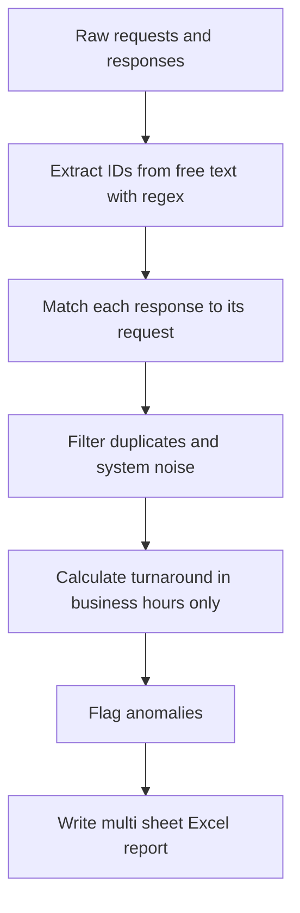

# Request Response Tracker

Matches workflow requests to their corresponding responses, calculates the true turnaround time counting business hours only, flags anomalies, and produces a clean multi sheet Excel report. Built to handle the messy, real world edge cases that operational data actually contains.

> **Note on data:** This repository uses only synthetic, generated data. It contains no real or proprietary information. A generator script is included so anyone can reproduce the full report.

## Why this project

In many operations, someone submits a request and someone else responds later, and the business wants to know how long responses really take. The honest answer is harder than subtracting two timestamps, because real data is messy:

- The identifier needed to match a response to its request is buried inside free text, not in its own column.
- Elapsed time should count only business hours, since a request sent Friday afternoon and answered Monday morning did not really take three days.
- Some records are duplicates or system generated noise that must be filtered out.

This project handles all three and turns the result into a report a manager can actually use.

## Approach



## What it does

1. **Extracts identifiers.** Uses regular expressions to pull the request identifier out of free text message fields.
2. **Matches requests to responses.** Pairs each request with its earliest valid response.
3. **Filters noise.** Removes duplicate and system generated entries so they do not distort the numbers.
4. **Calculates business hours.** Measures turnaround counting only working hours (for example 8 AM to 5 PM, weekdays), so weekends and nights do not inflate the result.
5. **Flags anomalies.** Marks responses that are unusually fast or slow for review.
6. **Builds the report.** Writes a multi sheet Excel workbook with a summary, full detail, and an anomalies sheet.

## The Excel output

The generated workbook contains three sheets:

- **Summary**, the key averages and counts at a glance
- **Detail**, every matched request and response with its turnaround
- **Anomalies**, the records flagged for a closer look

## Tech stack

- **Python** with pandas for the data work
- **openpyxl** for writing the formatted Excel workbook
- A synthetic data generator so the full report is reproducible

## Repository structure

```
request-response-tracker/
  README.md
  LICENSE
  .gitignore
  requirements.txt
  generate_synthetic_data.py   Creates synthetic requests and responses
  build_report.py              Matching, business hours math, Excel output
  sample_output/
    turnaround_report.xlsx      Example generated report
```

## Run it yourself

**Prerequisites:** Python 3.

1. Clone this repository.
2. Install the packages: `pip install -r requirements.txt`
3. Generate sample data: `python generate_synthetic_data.py`
4. Build the report: `python build_report.py`
5. Open `sample_output/turnaround_report.xlsx`.

## What this project demonstrates

- Regex extraction of structured values from messy free text
- Realistic business logic, including business hours only time calculations
- Data cleaning and anomaly detection on imperfect data
- Producing a polished, multi sheet Excel deliverable that a business user can act on

## License

Released under the MIT License. See the LICENSE file for details.
